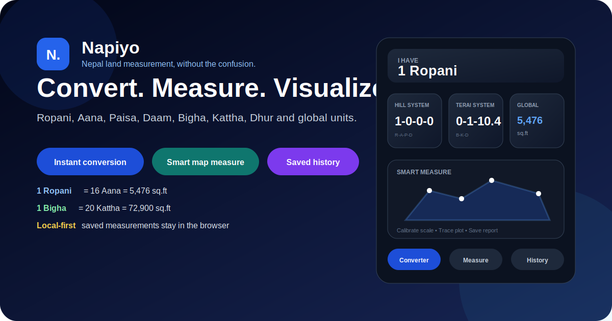
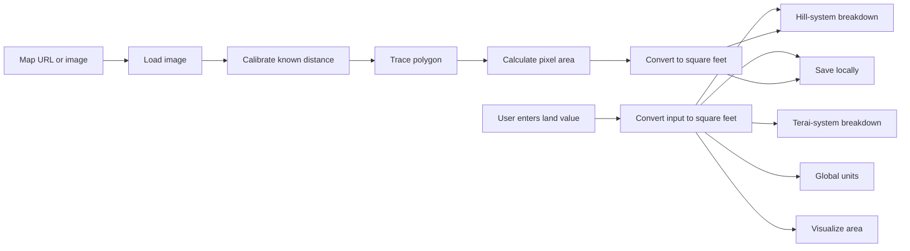
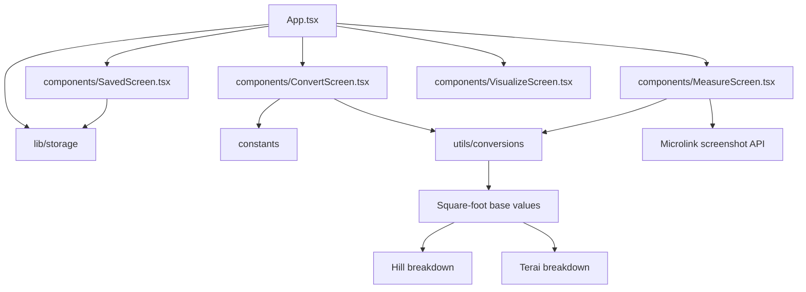

<div align="center">



# Napiyo

### Nepal land measurement, conversion, map tracing, saved calculations, and visual comparison in one focused utility.

<p>
  
  
  
  
  
</p>

[Overview](#overview) · [Features](#features) · [How it works](#how-it-works) · [Architecture](#architecture) · [Setup](#getting-started) · [Accuracy](#accuracy-and-responsible-use) · [Roadmap](#roadmap)

</div>

---

> [!NOTE]
> Napiyo is a working product prototype for Nepal-specific land conversion and visual measurement. It is useful for estimation, comparison, and understanding. It is not a replacement for certified survey data, cadastral records, legal documents, or a licensed professional.

## Overview

**Napiyo** helps users translate Nepal’s traditional land measurement systems into clear, modern values and practical visual workflows.

The product supports the two land-unit systems most commonly discussed in Nepal:

- **Hill system:** Ropani, Aana, Paisa, and Daam
- **Terai system:** Bigha, Kattha, and Dhur

It also converts results into global units such as square feet, square meters, square yards, acres, and hectares.

Beyond basic conversion, the current application includes a multi-step **Smart Measure** workflow for importing a map or image, calibrating scale, tracing a plot polygon, calculating its approximate area, and saving the result locally. It also includes calculation history and a dedicated visualization flow.

### Product goal

Napiyo is designed to make land calculations feel understandable and trustworthy for ordinary users, not only surveyors or engineers. The interface focuses on large inputs, immediate results, clear local-unit breakdowns, and simple action choices.

## Why this project exists

Land discussions in Nepal frequently mix regional and international units in the same conversation. A buyer may hear “one ropani,” receive a drawing in square feet, and later compare it with a Terai plot described in kattha or dhur. That creates room for confusion, bad assumptions, and expensive mistakes.

Napiyo reduces that friction by providing:

- one conversion source for local and global units
- a visual measuring workflow for plot images and map screenshots
- saved calculation history in the browser
- a clearer mental model for Hill and Terai systems
- a product experience designed around Nepal’s actual terminology

## Features

<table>
  <tr>
    <td width="50%" valign="top">
      <h3>Instant unit conversion</h3>
      <p>Enter a value in a supported unit and immediately see equivalent Hill, Terai, and global measurements.</p>
    </td>
    <td width="50%" valign="top">
      <h3>Smart Measure</h3>
      <p>Import a map URL or upload an image, calibrate a known distance, trace the plot boundary, and calculate an estimated area.</p>
    </td>
  </tr>
  <tr>
    <td width="50%" valign="top">
      <h3>Plot visualization</h3>
      <p>Open converted land values in a dedicated visualization view to make abstract square-foot values easier to understand.</p>
    </td>
    <td width="50%" valign="top">
      <h3>Saved calculations</h3>
      <p>Store converted and measured items locally, review them later, and delete entries that are no longer needed.</p>
    </td>
  </tr>
</table>

### Conversion capabilities

- Convert any supported input into square feet as the shared internal base.
- Display Hill-system output as `Ropani-Aana-Paisa-Daam`.
- Display Terai-system output as `Bigha-Kattha-Dhur`.
- Show square meters alongside square feet.
- Open an “all popular units” view for:
  - square meters
  - square yards
  - hectares
  - acres
- Save a conversion with its label, calculated square-foot value, date, type, and tags.
- Send the converted area directly to the visualization screen.

### Smart Measure workflow

The current measuring flow contains four explicit stages:

1. **Extract or upload**
   - Paste a map URL.
   - Request a screenshot through the Microlink API.
   - Fall back to a placeholder when extraction fails.
   - Upload an image manually from the user’s device.

2. **Calibrate**
   - Select two points representing a known real-world distance.
   - Enter the real distance in feet.
   - Calculate pixels-per-foot for the imported image.
   - Use the prototype auto-detect interaction to place a suggested scale line.

3. **Trace**
   - Click around the plot boundary.
   - Render the polygon over the imported image.
   - Close the polygon by selecting near the first point.

4. **Report**
   - Calculate polygon area in pixels.
   - Convert pixel area to approximate square feet using the calibration scale.
   - Display a Hill-system breakdown.
   - Save the measured item to local history.

> [!IMPORTANT]
> The automatic scale placement is currently a prototype interaction, not computer-vision detection. Users still need to verify the scale and traced boundary.

### Local history

The main application loads saved items when the app starts and writes updated items back through the local storage helper. Users can:

- save converted values
- save measured plots
- review saved entries
- delete individual records after confirmation

No account is required for this browser-based history.

## Supported units

### Hill system

| Unit | Relationship |
|---|---:|
| 1 Ropani | 16 Aana |
| 1 Aana | 4 Paisa |
| 1 Paisa | 4 Daam |

### Terai system

| Unit | Relationship |
|---|---:|
| 1 Bigha | 20 Kattha |
| 1 Kattha | 20 Dhur |

### Global units shown by the interface

| Unit | Current use |
|---|---|
| Square feet | Internal base and primary global result |
| Square meters | Main result card and expanded unit view |
| Square yards | Expanded unit view |
| Acres | Expanded unit view |
| Hectares | Expanded unit view |

## How it works



### Main application states

| State | Screen | Purpose |
|---|---|---|
| `CONVERT` | `ConvertScreen` | Unit input, conversion results, expanded units, save, and visualize actions |
| `MEASURE` | `MeasureScreen` | URL/image import, scale calibration, polygon tracing, and report generation |
| `SAVED` | `SavedScreen` | Local history and deletion |
| `VISUALIZE` | `VisualizeScreen` | Area visualization launched from a converted value |

The floating dock switches between Converter, Smart Measure, and History. The Settings control is currently present as an inactive placeholder.

## Architecture



### Technical summary

| Layer | Technology | Role |
|---|---|---|
| UI framework | React `18.3.1` | Screen composition and application state |
| Language | TypeScript | Types for screens, saved items, units, and conversion logic |
| Build system | Vite `5.x` | Development server and production build |
| Icons | Lucide React | Navigation and action icons |
| Browser persistence | Local storage helper | Saved calculations and measurements |
| External screenshot service | Microlink API | Map-page screenshot extraction in Smart Measure |
| Optional dependency | `@google/genai` | Installed dependency; no verified active GenAI feature in the current inspected screens |

> [!WARNING]
> The repository includes `@google/genai`, but the inspected application flow does not currently expose a verified AI-powered feature. The README therefore does not advertise one as implemented.

## Repository structure

```text
.
├── App.tsx                         Main application shell and screen routing
├── components/
│   ├── ConvertScreen.tsx           Unit conversion and expanded-unit modal
│   ├── MeasureScreen.tsx           Map/image calibration and polygon tracing
│   ├── SavedScreen.tsx             Saved calculation history
│   └── VisualizeScreen.tsx         Area visualization flow
├── lib/
│   └── storage                     Browser persistence helpers
├── utils/
│   └── conversions                 Unit conversion, formatting, distance, and polygon-area logic
├── constants                       Supported unit definitions and conversion constants
├── types                           Shared application types
├── index.html                      Vite application entry document
├── package.json                    Scripts and dependencies
├── tsconfig.json                   TypeScript configuration
├── vite.config.ts                  Vite configuration
├── docs/images/
│   └── napiyo-readme-hero.svg      Repository thumbnail and README hero
└── README.md                       Project documentation
```

## Product and interaction design

Napiyo uses a dark, glass-influenced interface with:

- a large central numerical input
- prominent local-unit selectors
- three parallel result cards for Hill, Terai, and global systems
- a floating dock inspired by desktop application navigation
- visual separation between conversion, measuring, history, and visualization tasks
- restrained blue accent colors for actions and traced geometry
- large labels and plain-language prompts

### Current usability strengths

- Conversion results appear immediately.
- Local-unit formats are displayed together rather than across separate pages.
- The measuring flow is divided into understandable stages.
- Imported images remain visible under the tracing overlay.
- The same calculated square-foot value can power conversion, saving, and visualization.

### Current UX limitations

- Settings is visible but not functional.
- Some interactions still use browser `alert`, `confirm`, and prototype-style fallback behavior.
- Smart Measure depends on accurate manual calibration.
- URL screenshot extraction depends on an external service and cross-origin image behavior.
- The current app shell uses a fixed-height desktop layout that may need additional mobile refinement.

## Getting started

### Requirements

- Node.js `18+` recommended
- npm, pnpm, or another compatible Node package manager

### Installation

```bash
git clone https://github.com/Nischhalsubba/Napiyo.git
cd Napiyo
npm install
npm run dev
```

Open the local URL shown by Vite, normally:

```text
http://localhost:5173/
```

### Available commands

| Command | Purpose |
|---|---|
| `npm run dev` | Start the Vite development server |
| `npm run build` | Create the production build |
| `npm run preview` | Serve the built app locally for verification |

### Production build

```bash
npm run build
npm run preview
```

Vite writes the production output to `dist/` by default.

## Deployment

Napiyo is a client-side React application and can be deployed to static frontend platforms such as:

- Cloudflare Pages
- Vercel
- Netlify
- Firebase Hosting
- GitHub Pages with the correct Vite base-path configuration

Typical settings:

```text
Build command: npm run build
Output directory: dist
```

> [!NOTE]
> Smart Measure’s URL extraction still depends on the external Microlink API after deployment. Manual image upload does not require that service.

## Accuracy and responsible use

Land calculations may affect purchasing, ownership, taxation, construction, inheritance, and legal disputes. Napiyo should therefore be treated as an estimation and learning tool.

Before relying on a result:

- compare conversion constants with an authoritative Nepal source
- verify plot dimensions against official records
- confirm map-image scale manually
- avoid using a traced screenshot as legal survey evidence
- consult a licensed surveyor, engineer, lawyer, or relevant government office when a decision carries financial or legal consequences

### Conversion QA checklist

- [ ] Verify every unit constant against a documented source.
- [ ] Test zero, empty, negative, fractional, and very large values.
- [ ] Verify Hill-system carry-over between Daam, Paisa, Aana, and Ropani.
- [ ] Verify Terai-system carry-over between Dhur, Kattha, and Bigha.
- [ ] Confirm square-foot and square-meter rounding behavior.
- [ ] Confirm acres, hectares, and square-yard conversions.
- [ ] Test saved values after a browser refresh.

### Smart Measure QA checklist

- [ ] Test local image upload across common formats.
- [ ] Test failed URL extraction and fallback behavior.
- [ ] Verify image scaling at different viewport sizes.
- [ ] Confirm two-point calibration with known distances.
- [ ] Test concave and convex polygons.
- [ ] Prevent accidental polygon closure.
- [ ] Confirm calculated area against a known reference plot.
- [ ] Communicate approximation clearly in the report.

## Privacy and external services

### Local data

Saved calculations are handled through the app’s browser storage helper. Users should understand that:

- clearing browser storage may remove saved items
- local history is not synchronized between devices
- anyone using the same browser profile may be able to access stored items

### External requests

When a user pastes a URL into Smart Measure, the app sends that URL to Microlink to request a screenshot. Users should avoid submitting private, authenticated, or sensitive map links without understanding that external processing occurs.

## Roadmap

### Product

- [ ] Add Nepali-language interface support.
- [ ] Add editable names, notes, and tags for saved plots.
- [ ] Add side-by-side comparison between saved measurements.
- [ ] Add printable and shareable conversion reports.
- [ ] Add offline/PWA support.
- [ ] Add explicit first-run education for Hill and Terai systems.
- [ ] Add professional precision and rounding controls.

### Smart Measure

- [ ] Replace simulated scale detection with real image analysis or remove the “Auto” label.
- [ ] Support undo and edit for traced polygon points.
- [ ] Add zoom and pan controls.
- [ ] Add line-length labels and perimeter calculation.
- [ ] Add stronger warnings when image scale is unreliable.
- [ ] Add support for multiple plots in one image.

### Engineering

- [ ] Add automated unit tests for conversion constants and polygon calculations.
- [ ] Add linting and formatting scripts.
- [ ] Add continuous integration for build verification.
- [ ] Add environment configuration for external APIs.
- [ ] Remove unused dependencies or connect them to verified features.
- [ ] Replace browser alerts with accessible in-product feedback.

<details>
<summary><strong>Suggested verification before a release</strong></summary>

```bash
npm install
npm run build
npm run preview
```

Then manually verify:

1. Conversion between at least one Hill, Terai, and global unit.
2. Expanded global-unit modal.
3. Save and delete history behavior.
4. Visualize action from a converted value.
5. Manual image upload in Smart Measure.
6. Calibration, tracing, polygon closure, report, and save flow.
7. Layout at desktop and narrow viewport widths.

</details>

## Credits

| Contribution | Person |
|---|---|
| Product design | Nischhal Raj Subba |
| Frontend implementation | Nischhal Raj Subba |
| Repository documentation | Nischhal Raj Subba |

---

<div align="center">

### Built for Nepal’s real-world land measurement context 🇳🇵

<sub>Clearer calculations are useful. Certified measurements are still certified measurements, because reality stubbornly refuses to become a dropdown.</sub>

</div>
