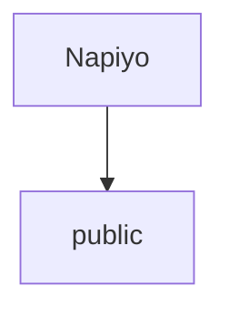
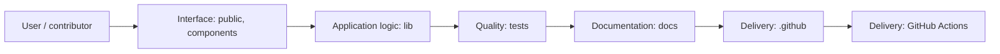
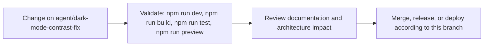

# Napiyo

<!-- interactive-readme-standard:start -->

> [!NOTE]
> **Branch-specific documentation:** this section is maintained for [`agent/dark-mode-contrast-fix`](https://github.com/Nischhalsubba/Napiyo/tree/agent/dark-mode-contrast-fix). It is generated from the files present on this branch and preserves the project-authored README below.

<details open>
<summary><strong>Interactive repository guide</strong></summary>

## Branch overview

| Item | Value |
|---|---|
| Repository | [`Nischhalsubba/Napiyo`](https://github.com/Nischhalsubba/Napiyo) |
| Branch | [`agent/dark-mode-contrast-fix`](https://github.com/Nischhalsubba/Napiyo/tree/agent/dark-mode-contrast-fix) |
| Detected stack | React, Vite, Tailwind CSS, TypeScript, CSS, HTML, JavaScript |
| Detected manifests | package.json |
| Documentation policy | Every maintained branch must explain purpose, setup, structure, architecture, flows, testing, delivery, security, and ownership. |

## Repository structure


```mermaid
flowchart TD
    ROOT["Napiyo / agent/dark-mode-contrast-fix"]
    ROOT --> P0[".github/"]
    ROOT --> P1["components/"]
    ROOT --> P2["docs/"]
    ROOT --> P3["lib/"]
    ROOT --> P4["public/"]
    ROOT --> P5["tests/"]
    ROOT --> P6["utils/"]
    ROOT --> P7[".node-version"]
    ROOT --> P8["accessibility.css"]
    ROOT --> P9["AGENTS.md"]
    ROOT --> P10["App.tsx"]
    ROOT --> P11["constants.ts"]
    ROOT --> P12["index.css"]
    ROOT --> P13["index.html"]
    ROOT --> P14["index.tsx"]
    ROOT --> P15["metadata.json"]
    ROOT --> P16["package.json"]
    ROOT --> P17["tsconfig.json"]
    ROOT --> MORE["+ 3 more top-level entries"]
```

The diagram is generated from the branch's actual top-level files and directories. Use the branch link above for complete source navigation.

## Website or application structure


```mermaid
flowchart TD
    APP["Napiyo"]
    APP --> R0["public"]
```

## Application and responsibility flow


```mermaid
flowchart LR
    ACTOR["User / contributor"]
    ACTOR --> A0["Interface: public, components"]
    A0 --> A1["Application logic: lib"]
    A1 --> A2["Quality: tests"]
    A2 --> A3["Documentation: docs"]
    A3 --> A4["Delivery: .github"]
    A4 --> DELIVERY["Delivery: GitHub Actions"]
```

## Change-to-delivery flow


```mermaid
flowchart LR
    CHANGE["Change on agent/dark-mode-contrast-fix"]
    CHECK["Validate: npm run dev, npm run build, npm run test, npm run preview"]
    REVIEW["Review documentation and architecture impact"]
    RELEASE["Merge, release, or deploy according to this branch"]
    CHANGE --> CHECK --> REVIEW --> RELEASE
```

## README requirements for this branch

- Explain what this branch contains and how it differs from the default branch.
- Keep installation, configuration, usage, testing, deployment, security, support, and license information accurate.
- Document repository, website or application, API, data, authentication, background-job, and deployment flows when they exist.
- Prefer Mermaid diagrams and expandable `<details>` sections for visual navigation.
- Link diagrams and modules to real source paths; never invent missing components.
- Preserve project-specific documentation and update diagrams whenever architecture or major paths change.
- Treat secrets, private infrastructure, customer data, and credentials as prohibited README content.

</details>

<!-- interactive-readme-standard:end -->

Napiyo is a Nepal-focused land area utility for converting local and global units, estimating plot area from an image, visualizing scale, and saving calculations in the browser.

## What it supports

- Hill system: Ropani, Aana, Paisa, Daam
- Terai system: Bigha, Kattha, Dhur
- Global units: square feet, square metres, square yards, acres, hectares
- Image-based plot estimation with manual scale calibration and polygon tracing
- Local saved history and two-item comparison
- Responsive layouts for phone, tablet, and desktop

> Napiyo is an estimation and learning tool. It does not replace certified survey data, cadastral records, legal documents, or licensed professionals.

## Stack

- React 19
- TypeScript
- Vite 8
- Tailwind CSS 4 through the Vite plugin
- Lucide icons
- Browser local storage
- Cloudflare Pages

## Local development

Requirements:

- Node.js 22.16 or newer
- npm 10.9 or newer

```bash
npm install
npm run dev
```

Validation:

```bash
npm run check
npm run build
npm run preview
```

## Cloudflare Pages deployment

Connect this repository to Cloudflare Pages and use:

```text
Production branch: main
Build command: npm run build
Build output directory: dist
Node version: 22.16.0
```

The repository includes:

- `.node-version` to pin the Pages build runtime
- `public/_redirects` for SPA navigation fallback
- `public/_headers` for baseline security and asset caching headers

Cloudflare creates preview deployments for pull requests and deploys production after changes reach `main`.

## Data and privacy

Saved calculations remain in the current browser through local storage. Napiyo does not require an account. Uploaded images are processed in the browser and are not stored by Napiyo. The optional URL import uses the Microlink screenshot service, which is separate from Napiyo and may have its own limits and policies.

## Accuracy notes

Unit conversion factors are deterministic. Image-based measurement can vary because of:

- image perspective and distortion
- inaccurate reference distance
- imprecise boundary tracing
- map screenshots that are not top-down or to scale

Always verify consequential property decisions with official records and qualified professionals.
