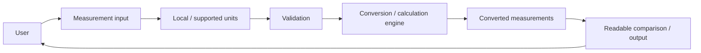
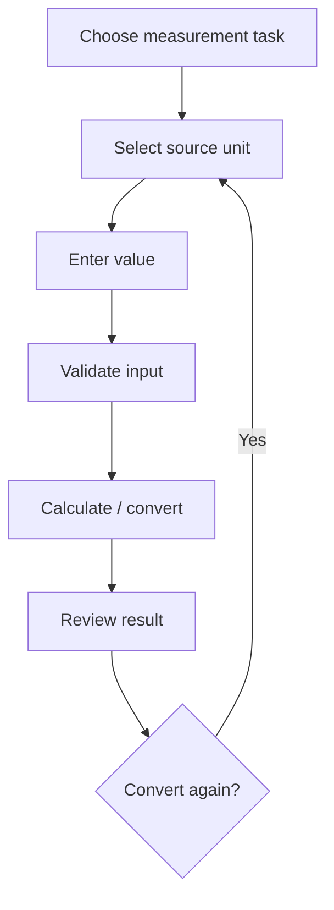

<div align="center">

# Napiyo

**A Nepal-focused land measurement product shaped around local terminology, practical conversions, and everyday property-measurement workflows.**


[Browse source](https://github.com/Nischhalsubba/Napiyo/tree/main) · [Issues](https://github.com/Nischhalsubba/Napiyo/issues)

</div>

## Overview

**Napiyo** is a land-measurement experience designed around the way land area is discussed and calculated in Nepal. The product should make conversions and measurement relationships easy to inspect instead of forcing users to translate local units into unfamiliar systems first.

| Audience | Focus |
|---|---|
| Landowners / users | Enter measurements and understand results clearly |
| Developers | Conversion rules, validation, precision and UI state |
| Designers | Local terminology, numeric input, responsive forms and result clarity |
| Domain reviewers | Unit definitions, formulas, rounding and regional assumptions |

<details open>
<summary><strong>🏗️ Interactive measurement architecture</strong></summary>


```mermaid
flowchart LR
    USER["User"] --> INPUT["Measurement input"]
    INPUT --> UNIT["Local / supported units"]
    UNIT --> VALIDATE["Validation"]
    VALIDATE --> ENGINE["Conversion / calculation engine"]
    ENGINE --> RESULT["Converted measurements"]
    RESULT --> UI["Readable comparison / output"]
    UI --> USER
```

</details>

## Measurement flow


```mermaid
flowchart TD
    START["Choose measurement task"] --> UNIT["Select source unit"] --> VALUE["Enter value"] --> CHECK["Validate input"] --> CALC["Calculate / convert"] --> RESULT["Review result"] --> NEXT{"Convert again?"}
    NEXT -->|Yes| UNIT
```

## Getting started

```bash
git clone https://github.com/Nischhalsubba/Napiyo.git
cd Napiyo
```

Use the manifests and lockfiles in the repository to determine the supported runtime and development commands.

## Product & design principles

Numbers need context. Always show the active units, prevent ambiguous input, define rounding behavior, preserve precision where it matters, make errors specific, and avoid implying survey/legal certainty when a calculation is only a convenience conversion.

## SEO & Nepal discoverability

Public pages should naturally use accurate terms such as **Nepal land measurement, land unit converter Nepal, ropani, aana, paisa, daam, bigha, kattha, dhur, square feet, square meter, and land area conversion** only where those units are genuinely supported. Maintain useful titles/descriptions, semantic headings, canonical URLs, structured FAQ/content where appropriate, and indexable explanatory text.

## Contribution flow


```mermaid
flowchart LR
    RULE["Unit / formula change"] --> VERIFY["Verify domain source"] --> IMPLEMENT["Update calculation / UI"] --> TEST["Boundary + precision tests"] --> UX["Review labels / errors"] --> PR["Pull request"]
```
