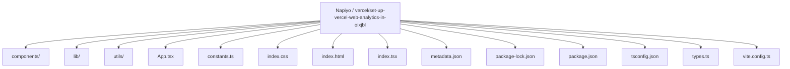
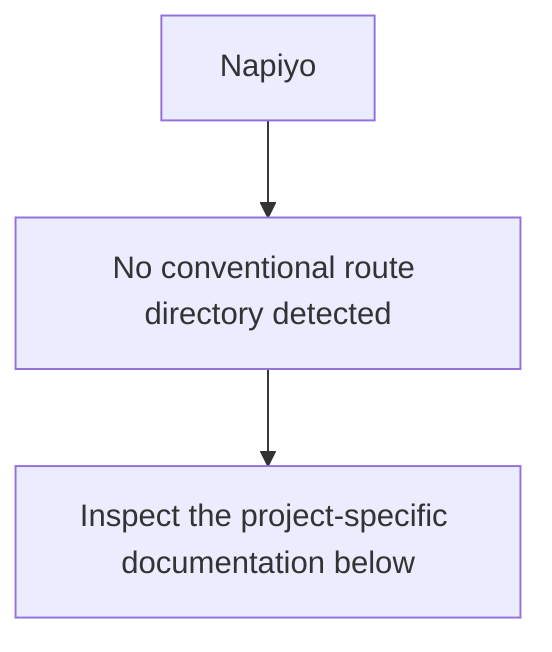
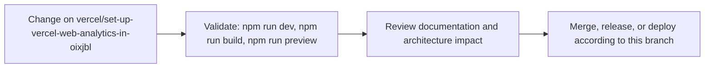

# Napiyo

<!-- interactive-readme-standard:start -->

> [!NOTE]
> **Branch-specific documentation:** this section is maintained for [`vercel/set-up-vercel-web-analytics-in-oixjbl`](https://github.com/Nischhalsubba/Napiyo/tree/vercel/set-up-vercel-web-analytics-in-oixjbl). It is generated from the files present on this branch and preserves the project-authored README below.

<details open>
<summary><strong>Interactive repository guide</strong></summary>

## Branch overview

| Item | Value |
|---|---|
| Repository | [`Nischhalsubba/Napiyo`](https://github.com/Nischhalsubba/Napiyo) |
| Branch | [`vercel/set-up-vercel-web-analytics-in-oixjbl`](https://github.com/Nischhalsubba/Napiyo/tree/vercel/set-up-vercel-web-analytics-in-oixjbl) |
| Detected stack | React, Vite, TypeScript, HTML, CSS |
| Detected manifests | package.json |
| Documentation policy | Every maintained branch must explain purpose, setup, structure, architecture, flows, testing, delivery, security, and ownership. |

## Repository structure


```mermaid
flowchart TD
    ROOT["Napiyo / vercel/set-up-vercel-web-analytics-in-oixjbl"]
    ROOT --> P0["components/"]
    ROOT --> P1["lib/"]
    ROOT --> P2["utils/"]
    ROOT --> P3["App.tsx"]
    ROOT --> P4["constants.ts"]
    ROOT --> P5["index.css"]
    ROOT --> P6["index.html"]
    ROOT --> P7["index.tsx"]
    ROOT --> P8["metadata.json"]
    ROOT --> P9["package-lock.json"]
    ROOT --> P10["package.json"]
    ROOT --> P11["tsconfig.json"]
    ROOT --> P12["types.ts"]
    ROOT --> P13["vite.config.ts"]
```

The diagram is generated from the branch's actual top-level files and directories. Use the branch link above for complete source navigation.

## Website or application structure


```mermaid
flowchart TD
    APP["Napiyo"]
    APP --> SOURCE["No conventional route directory detected"]
    SOURCE --> VERIFY["Inspect the project-specific documentation below"]
```

## Application and responsibility flow


```mermaid
flowchart LR
    ACTOR["User / contributor"]
    ACTOR --> A0["Interface: components"]
    A0 --> A1["Application logic: lib"]
```

## Change-to-delivery flow


```mermaid
flowchart LR
    CHANGE["Change on vercel/set-up-vercel-web-analytics-in-oixjbl"]
    CHECK["Validate: npm run dev, npm run build, npm run preview"]
    REVIEW["Review documentation and architecture impact"]
    RELEASE["Merge, release, or deploy according to this branch"]
    CHANGE --> CHECK --> REVIEW --> RELEASE
```

## README requirements for this branch

- Explain what this branch contains and how it differs from the default branch.
- Keep installation, configuration, usage, testing, deployment, security, support, and license information accurate.
- Document repository, website or application, API, data, authentication, background-job, and deployment flows when they exist.
- Prefer Mermaid diagrams and expandable `<details>` sections for visual navigation.
- Link diagrams and modules to real source paths; never invent missing components.
- Preserve project-specific documentation and update diagrams whenever architecture or major paths change.
- Treat secrets, private infrastructure, customer data, and credentials as prohibited README content.

</details>

<!-- interactive-readme-standard:end -->

**Napiyo** is a premier land measurement and unit conversion utility built specifically for the Nepalese context. Bridging the gap between traditional measurement systems and modern technology, Napiyo provides an intuitive interface for real estate professionals, landowners, and engineers to calculate and visualize land areas with precision.

## Overview

Handling land measurements in Nepal can be complex due to the dual systems used in different regions (Hills vs. Terai). Napiyo simplifies this by offering:
- **Smart Conversions**: Seamlessly translate between Ropani/Aana/Paisa/Daam, Bigha/Kattha/Dhur, and standard metric/imperial units.
- **Visual Tools**: Interactive measurement capabilities for maps and plot analysis.
- **Data Management**: Save specific calculations, manage history, and compare multiple plots effortlessly.

## Features

- **🇳🇵 Region-Specific Units**: Full support for both Hill (Ropani system) and Terai (Bigha system) measurements.
- **🔄 Universal Converter**: Instant conversion to and from Sq. Feet, Sq. Meters, and other standard units.
- **📱 Responsive Design**: A measuring tool that works perfectly on desktop and mobile devices.
- **💾 Save & Organize**: Keep track of your measurements with a dedicated 'Saved' section.

## Tech Stack

Built with a focus on performance and user experience:
- **Frontend**: React + TypeScript
- **Build Tool**: Vite
- **Styling**: Tailwind CSS
- **Icons**: Lucide React

## Credits

- **Designed by**: Nischhal Raj Subba
- **Coded by**: Nischhal Raj Subba

## Getting Started

To run this project locally:

1. **Install dependencies**
   ```bash
   npm install
   ```

2. **Run the development server**
   ```bash
   npm run dev
   ```
