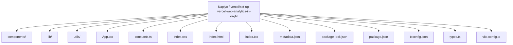
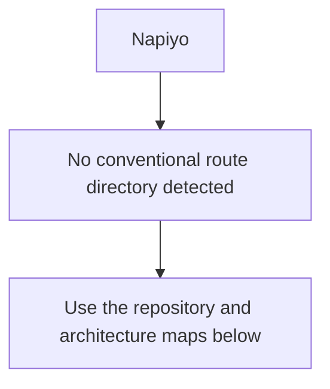
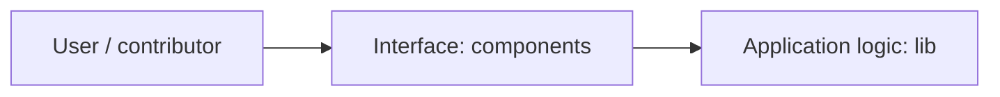
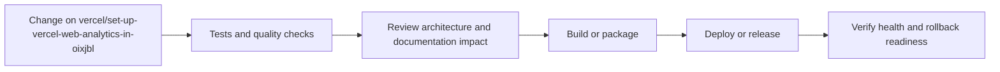

<!-- interactive-readme-standard:start -->

<div align="center">

# Napiyo

**Branch-aware technical guide for [`vercel/set-up-vercel-web-analytics-in-oixjbl`](https://github.com/Nischhalsubba/Napiyo/tree/vercel/set-up-vercel-web-analytics-in-oixjbl)**

<p>      </p>

<p>
  <a href="https://github.com/Nischhalsubba/Napiyo/tree/vercel/set-up-vercel-web-analytics-in-oixjbl"><strong>Browse source</strong></a> ·
  <a href="https://github.com/Nischhalsubba/Napiyo/issues"><strong>Issues</strong></a> ·
  <a href="https://github.com/Nischhalsubba/Napiyo/codespaces/new?ref=vercel%2Fset-up-vercel-web-analytics-in-oixjbl"><strong>Open in Codespaces</strong></a>
</p>

</div>

> [!IMPORTANT]
> This guide is generated from the files actually present on `vercel/set-up-vercel-web-analytics-in-oixjbl`. It links to detected source paths, preserves project-authored notes, and avoids claiming components that were not found.

## At a glance

| Item | Detected value |
|---|---|
| Purpose | A React project documented from the current branch structure and manifests. |
| Branch role | Compared with `main` |
| Stack | React, Vite, TypeScript, HTML, CSS |
| Manifests | package.json |
| Prerequisites | Node.js |
| Delivery | No conventional deployment configuration detected |
| License | No license file detected |

## Branch scope

This branch differs from the default branch in the following detected paths:

- [`App.tsx`](https://github.com/Nischhalsubba/Napiyo/blob/vercel/set-up-vercel-web-analytics-in-oixjbl/App.tsx)
- [`README.md`](https://github.com/Nischhalsubba/Napiyo/blob/vercel/set-up-vercel-web-analytics-in-oixjbl/README.md)
- [`package-lock.json`](https://github.com/Nischhalsubba/Napiyo/blob/vercel/set-up-vercel-web-analytics-in-oixjbl/package-lock.json)
- [`package.json`](https://github.com/Nischhalsubba/Napiyo/blob/vercel/set-up-vercel-web-analytics-in-oixjbl/package.json)

## Quick start

```bash
npm install
npm run dev
npm run build
npm run preview
```

### Configuration surface

- No committed environment example file was detected.

> Never commit secrets, private keys, production credentials, customer data, or unredacted infrastructure details.

## Repository map


```mermaid
flowchart TD
    ROOT["Napiyo / vercel/set-up-vercel-web-analytics-in-oixjbl"]
    ROOT --> P0["components/"]
    ROOT --> P1["lib/"]
    ROOT --> P2["utils/"]
    ROOT --> P3["App.tsx"]
    ROOT --> P4["constants.ts"]
    ROOT --> P5["index.css"]
    ROOT --> P6["index.html"]
    ROOT --> P7["index.tsx"]
    ROOT --> P8["metadata.json"]
    ROOT --> P9["package-lock.json"]
    ROOT --> P10["package.json"]
    ROOT --> P11["tsconfig.json"]
    ROOT --> P12["types.ts"]
    ROOT --> P13["vite.config.ts"]
```

| Responsibility | Detected source paths |
|---|---|
| Interface | [`components`](https://github.com/Nischhalsubba/Napiyo/tree/vercel/set-up-vercel-web-analytics-in-oixjbl/components) |
| Application logic | [`lib`](https://github.com/Nischhalsubba/Napiyo/tree/vercel/set-up-vercel-web-analytics-in-oixjbl/lib) |

## Website or application map


```mermaid
flowchart TD
    APP["Napiyo"]
    APP --> SOURCE["No conventional route directory detected"]
    SOURCE --> GUIDE["Use the repository and architecture maps below"]
```

## Architecture and responsibility flow


```mermaid
flowchart LR
    USER["User / contributor"]
    USER --> A0["Interface: components"]
    A0 --> A1["Application logic: lib"]
```


## Quality, security, and operations

<table>
<tr>
<td width="33%" valign="top">

### Quality

- No conventional test directory was detected automatically.

Detected commands:
- `npm run dev`
- `npm run build`
- `npm run preview`

</td>
<td width="33%" valign="top">

### Security

- No dedicated security policy or automated dependency configuration was detected.

Review authentication, authorization, input validation, dependency updates, secret handling, and failure recovery before release.

</td>
<td width="34%" valign="top">

### Observability

- No dedicated observability integration was detected automatically.

Define useful logs, metrics, traces, alerts, and rollback signals for production-facing branches.

</td>
</tr>
</table>

## Delivery flow


```mermaid
flowchart LR
    CHANGE["Change on vercel/set-up-vercel-web-analytics-in-oixjbl"] --> CHECK["Tests and quality checks"]
    CHECK --> REVIEW["Review architecture and documentation impact"]
    REVIEW --> BUILD["Build or package"]
    BUILD --> DEPLOY["Deploy or release"]
    DEPLOY --> VERIFY["Verify health and rollback readiness"]
```

### Automation detected

- No GitHub Actions workflow files were detected.

## Contribution flow


```mermaid
flowchart LR
    FORK["Create branch"] --> CHANGE["Make focused change"]
    CHANGE --> TEST["Run relevant checks"]
    TEST --> DOCS["Update README and diagrams"]
    DOCS --> PR["Open pull request"]
    PR --> REVIEW["Review and iterate"]
    REVIEW --> MERGE["Merge when ready"]
```

- Keep changes focused and explain architectural consequences.
- Run the checks relevant to the changed area.
- Update diagrams whenever routes, modules, data models, authentication, jobs, or delivery paths change.
- Add screenshots or recordings for visual behavior changes when useful.
- Use issues for reproducible defects and pull requests for reviewable changes.

## Ownership and support

| Topic | Source |
|---|---|
| Repository | [`Nischhalsubba/Napiyo`](https://github.com/Nischhalsubba/Napiyo) |
| Branch | [`vercel/set-up-vercel-web-analytics-in-oixjbl`](https://github.com/Nischhalsubba/Napiyo/tree/vercel/set-up-vercel-web-analytics-in-oixjbl) |
| Ownership | No CODEOWNERS file detected |
| Contributing | Use the contribution flow above |
| Support | [Open or review issues](https://github.com/Nischhalsubba/Napiyo/issues) |
| License | No license file detected |

<details>
<summary><strong>Documentation maintenance checklist</strong></summary>

- [ ] Purpose and branch scope are accurate.
- [ ] Setup and configuration commands still work.
- [ ] Repository, application, API, data, authentication, job, and deployment diagrams match the code.
- [ ] Tests, security controls, observability, and rollback behavior are documented.
- [ ] Links point to real files on this branch.
- [ ] No secrets or private operational details are exposed.

</details>

<!-- interactive-readme-standard:end -->

<!-- project-authored-notes:start -->
<details>
<summary><strong>Project-authored notes preserved from this branch</strong></summary>

# Napiyo

**Napiyo** is a premier land measurement and unit conversion utility built specifically for the Nepalese context. Bridging the gap between traditional measurement systems and modern technology, Napiyo provides an intuitive interface for real estate professionals, landowners, and engineers to calculate and visualize land areas with precision.

## Overview

Handling land measurements in Nepal can be complex due to the dual systems used in different regions (Hills vs. Terai). Napiyo simplifies this by offering:
- **Smart Conversions**: Seamlessly translate between Ropani/Aana/Paisa/Daam, Bigha/Kattha/Dhur, and standard metric/imperial units.
- **Visual Tools**: Interactive measurement capabilities for maps and plot analysis.
- **Data Management**: Save specific calculations, manage history, and compare multiple plots effortlessly.

## Features

- **🇳🇵 Region-Specific Units**: Full support for both Hill (Ropani system) and Terai (Bigha system) measurements.
- **🔄 Universal Converter**: Instant conversion to and from Sq. Feet, Sq. Meters, and other standard units.
- **📱 Responsive Design**: A measuring tool that works perfectly on desktop and mobile devices.
- **💾 Save & Organize**: Keep track of your measurements with a dedicated 'Saved' section.

## Tech Stack

Built with a focus on performance and user experience:
- **Frontend**: React + TypeScript
- **Build Tool**: Vite
- **Styling**: Tailwind CSS
- **Icons**: Lucide React

## Credits

- **Designed by**: Nischhal Raj Subba
- **Coded by**: Nischhal Raj Subba

## Getting Started

To run this project locally:

1. **Install dependencies**
   ```bash
   npm install
   ```

2. **Run the development server**
   ```bash
   npm run dev
   ```

</details>
<!-- project-authored-notes:end -->
