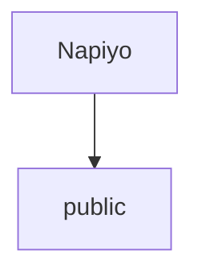
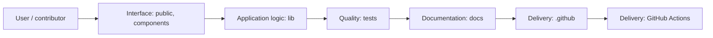

<!-- interactive-readme-standard:start -->

<div align="center">

# Napiyo

**Branch-aware technical guide for [`agent/worldclass-core-release`](https://github.com/Nischhalsubba/Napiyo/tree/agent/worldclass-core-release)**

<p>       </p>

<p>
  <a href="https://github.com/Nischhalsubba/Napiyo/tree/agent/worldclass-core-release"><strong>Browse source</strong></a> ·
  <a href="https://github.com/Nischhalsubba/Napiyo/issues"><strong>Issues</strong></a> ·
  <a href="https://github.com/Nischhalsubba/Napiyo/codespaces/new?ref=agent%2Fworldclass-core-release"><strong>Open in Codespaces</strong></a>
</p>

</div>

> [!IMPORTANT]
> This guide is generated from the files actually present on `agent/worldclass-core-release`. It links to detected source paths, preserves project-authored notes, and avoids claiming components that were not found.

## At a glance

| Item | Detected value |
|---|---|
| Purpose | A trustworthy, Nepal-focused land unit converter, plot estimator, visualizer, and saved calculation utility. |
| Branch role | Compared with `main` |
| Stack | React, Vite, Tailwind CSS, TypeScript, CSS, HTML, JavaScript |
| Manifests | package.json |
| Prerequisites | Node.js |
| Delivery | GitHub Actions |
| License | No license file detected |

## Branch scope

This branch differs from the default branch in the following detected paths:

- [`README.md`](https://github.com/Nischhalsubba/Napiyo/blob/agent/worldclass-core-release/README.md)

## Quick start

```bash
npm install
npm run dev
npm run build
npm run test
npm run preview
```

### Configuration surface

- No committed environment example file was detected.

> Never commit secrets, private keys, production credentials, customer data, or unredacted infrastructure details.

## Repository map


```mermaid
flowchart TD
    ROOT["Napiyo / agent/worldclass-core-release"]
    ROOT --> P0[".github/"]
    ROOT --> P1["components/"]
    ROOT --> P2["docs/"]
    ROOT --> P3["lib/"]
    ROOT --> P4["public/"]
    ROOT --> P5["tests/"]
    ROOT --> P6["utils/"]
    ROOT --> P7[".node-version"]
    ROOT --> P8["accessibility.css"]
    ROOT --> P9["AGENTS.md"]
    ROOT --> P10["App.tsx"]
    ROOT --> P11["constants.ts"]
    ROOT --> P12["index.css"]
    ROOT --> P13["index.html"]
    ROOT --> P14["index.tsx"]
    ROOT --> P15["metadata.json"]
    ROOT --> P16["package.json"]
    ROOT --> P17["tsconfig.json"]
    ROOT --> MORE["+ 2 more top-level entries"]
```

| Responsibility | Detected source paths |
|---|---|
| Interface | [`public`](https://github.com/Nischhalsubba/Napiyo/tree/agent/worldclass-core-release/public), [`components`](https://github.com/Nischhalsubba/Napiyo/tree/agent/worldclass-core-release/components) |
| Application logic | [`lib`](https://github.com/Nischhalsubba/Napiyo/tree/agent/worldclass-core-release/lib) |
| Quality | [`tests`](https://github.com/Nischhalsubba/Napiyo/tree/agent/worldclass-core-release/tests) |
| Documentation | [`docs`](https://github.com/Nischhalsubba/Napiyo/tree/agent/worldclass-core-release/docs) |
| Delivery | [`.github`](https://github.com/Nischhalsubba/Napiyo/tree/agent/worldclass-core-release/.github) |

## Website or application map


```mermaid
flowchart TD
    APP["Napiyo"]
    APP --> R0["public"]
```

## Architecture and responsibility flow


```mermaid
flowchart LR
    USER["User / contributor"]
    USER --> A0["Interface: public, components"]
    A0 --> A1["Application logic: lib"]
    A1 --> A2["Quality: tests"]
    A2 --> A3["Documentation: docs"]
    A3 --> A4["Delivery: .github"]
    A4 --> DELIVERY["Delivery: GitHub Actions"]
```


## Quality, security, and operations

<table>
<tr>
<td width="33%" valign="top">

### Quality

- [`tests`](https://github.com/Nischhalsubba/Napiyo/tree/agent/worldclass-core-release/tests)

Detected commands:
- `npm run dev`
- `npm run build`
- `npm run test`
- `npm run preview`

</td>
<td width="33%" valign="top">

### Security

- No dedicated security policy or automated dependency configuration was detected.

Review authentication, authorization, input validation, dependency updates, secret handling, and failure recovery before release.

</td>
<td width="34%" valign="top">

### Observability

- No dedicated observability integration was detected automatically.

Define useful logs, metrics, traces, alerts, and rollback signals for production-facing branches.

</td>
</tr>
</table>

## Delivery flow


```mermaid
flowchart LR
    CHANGE["Change on agent/worldclass-core-release"] --> CHECK["Tests and quality checks"]
    CHECK --> REVIEW["Review architecture and documentation impact"]
    REVIEW --> BUILD["Build or package"]
    BUILD --> DEPLOY["Deploy or release"]
    DEPLOY --> VERIFY["Verify health and rollback readiness"]
```

### Automation detected

- [`.github/workflows/ci.yml`](https://github.com/Nischhalsubba/Napiyo/blob/agent/worldclass-core-release/.github/workflows/ci.yml)
- [`.github/workflows/quality.yml`](https://github.com/Nischhalsubba/Napiyo/blob/agent/worldclass-core-release/.github/workflows/quality.yml)

## Contribution flow


```mermaid
flowchart LR
    FORK["Create branch"] --> CHANGE["Make focused change"]
    CHANGE --> TEST["Run relevant checks"]
    TEST --> DOCS["Update README and diagrams"]
    DOCS --> PR["Open pull request"]
    PR --> REVIEW["Review and iterate"]
    REVIEW --> MERGE["Merge when ready"]
```

- Keep changes focused and explain architectural consequences.
- Run the checks relevant to the changed area.
- Update diagrams whenever routes, modules, data models, authentication, jobs, or delivery paths change.
- Add screenshots or recordings for visual behavior changes when useful.
- Use issues for reproducible defects and pull requests for reviewable changes.

## Ownership and support

| Topic | Source |
|---|---|
| Repository | [`Nischhalsubba/Napiyo`](https://github.com/Nischhalsubba/Napiyo) |
| Branch | [`agent/worldclass-core-release`](https://github.com/Nischhalsubba/Napiyo/tree/agent/worldclass-core-release) |
| Ownership | No CODEOWNERS file detected |
| Contributing | Use the contribution flow above |
| Support | [Open or review issues](https://github.com/Nischhalsubba/Napiyo/issues) |
| License | No license file detected |

<details>
<summary><strong>Documentation maintenance checklist</strong></summary>

- [ ] Purpose and branch scope are accurate.
- [ ] Setup and configuration commands still work.
- [ ] Repository, application, API, data, authentication, job, and deployment diagrams match the code.
- [ ] Tests, security controls, observability, and rollback behavior are documented.
- [ ] Links point to real files on this branch.
- [ ] No secrets or private operational details are exposed.

</details>

<!-- interactive-readme-standard:end -->

<!-- project-authored-notes:start -->
<details>
<summary><strong>Project-authored notes preserved from this branch</strong></summary>

# Napiyo

Napiyo is a Nepal-focused land area utility for converting local and global units, estimating plot area from an image, visualizing scale, and saving calculations in the browser.

## What it supports

- Hill system: Ropani, Aana, Paisa, Daam
- Terai system: Bigha, Kattha, Dhur
- Global units: square feet, square metres, square yards, acres, hectares
- Image-based plot estimation with manual scale calibration and polygon tracing
- Local saved history and two-item comparison
- Responsive layouts for phone, tablet, and desktop

> Napiyo is an estimation and learning tool. It does not replace certified survey data, cadastral records, legal documents, or licensed professionals.

## Stack

- React 19
- TypeScript
- Vite 8
- Tailwind CSS 4 through the Vite plugin
- Lucide icons
- Browser local storage
- Cloudflare Pages

## Local development

Requirements:

- Node.js 22.16 or newer
- npm 10.9 or newer

```bash
npm install
npm run dev
```

Validation:

```bash
npm run check
npm run build
npm run preview
```

## Cloudflare Pages deployment

Connect this repository to Cloudflare Pages and use:

```text
Production branch: main
Build command: npm run build
Build output directory: dist
Node version: 22.16.0
```

The repository includes:

- `.node-version` to pin the Pages build runtime
- `public/_redirects` for SPA navigation fallback
- `public/_headers` for baseline security and asset caching headers

Cloudflare creates preview deployments for pull requests and deploys production after changes reach `main`.

## Data and privacy

Saved calculations remain in the current browser through local storage. Napiyo does not require an account. Uploaded images are processed in the browser and are not stored by Napiyo. The optional URL import uses the Microlink screenshot service, which is separate from Napiyo and may have its own limits and policies.

## Accuracy notes

Unit conversion factors are deterministic. Image-based measurement can vary because of:

- image perspective and distortion
- inaccurate reference distance
- imprecise boundary tracing
- map screenshots that are not top-down or to scale

Always verify consequential property decisions with official records and qualified professionals.

</details>
<!-- project-authored-notes:end -->
